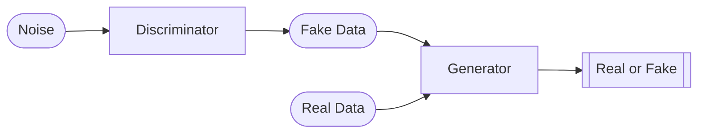

# What is a Generative Adversial Network?

A GAN is an architecture that was motivated by the idea of creating new data. If we distill the GAN to its components, we can view it as a game. A **generator** takes some noise as input, and tries to transform it to some target data (with some useful distribution). At the same time, a **discriminator** takes a set of real data, and some fake data that has been generated via the generator, and tries to determine which are fake and which are real. In this way, the generator is effectively trying to "trick" the discriminator by creating data so convincing that the discriminator can't accurately discern real and fake data.

# Why is it useful?

GANs allow us to generate new data from noise, and therefore can be very helpful in many fields. One practical example is in medical imaging, where patient privacy might be important. Instead of using real patient information, a GAN could be trained on real patient information, and any further work could be done on fake imaging created by the generator of the trained GAN.

# The Math

If we let $D$ be the discriminator function, and $G$ be the generator function, consider the following scenario.

We sample 
